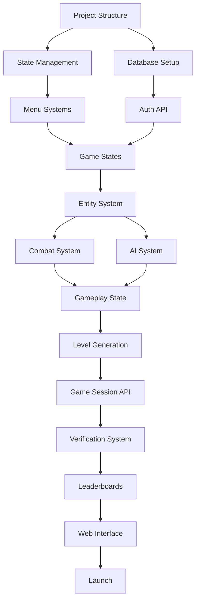

# shellquest.sh - Implementation Task List

## Priority Legend
- 🔴 **Critical** - Core functionality, blocks other tasks
- 🟡 **High** - Important features, needed for MVP
- 🟢 **Medium** - Enhances gameplay, can be deferred
- 🔵 **Low** - Nice to have, post-launch

## Phase 1: Core Infrastructure

### 1.1 Project Structure Setup
- [x] 🔴 Create new directory structure under `game/src/game/`
- [x] 🔴 Move existing crawler demo to `game/src/examples/crawler-demo/` for reference
- [x] 🔴 Create main game entry point `game/src/game/main.ts`
- [x] 🔴 Set up TypeScript paths for clean imports
- [x] 🔴 Create constants file for game configuration

### 1.2 State Management
- [x] 🔴 Implement `StateManager` class with state stack
- [x] 🔴 Create `BaseState` abstract class
- [x] 🔴 Implement `SplashState` with logo animation (OpenTUI components)
- [x] 🔴 Implement `AuthState` with login/register forms (OpenTUI components)
- [x] 🔴 Implement `MainMenuState` with navigation
- [x] 🔴 Implement `CharacterSelectState` with list UI
- [x] 🔴 Implement `CharacterCreateState` with form
- [x] 🔴 Implement `GameplayState` skeleton
- [x] 🔴 Implement `GameOverState` with results
- [x] 🔴 Implement `LeaderboardState` with pagination
- [x] 🟡 Add state transition animations

### 1.3 Database Setup
- [ ] 🔴 Update Prisma schema with all models
- [ ] 🔴 Create migration for new schema
- [ ] 🔴 Set up seed data for testing
- [ ] 🔴 Configure database connection pooling
- [ ] 🔴 Add database indexes for performance

## Phase 2: Game Systems Implementation

### 2.1 Entity System
- [ ] 🔴 Create `Entity` base class
- [ ] 🔴 Implement `Player` class with stats
- [ ] 🔴 Create `Enemy` base class
- [ ] 🔴 Implement enemy types (Skeleton, Goblin, Orc, Wizard)
- [ ] 🔴 Create `Item` class for pickups
- [ ] 🔴 Implement `Projectile` class for ranged attacks
- [ ] 🟡 Add entity pooling for performance

### 2.2 Combat System
- [ ] 🔴 Implement `CombatManager` class
- [ ] 🔴 Create weapon swing mechanics
- [ ] 🔴 Implement collision detection for attacks
- [ ] 🔴 Add damage calculation with modifiers
- [ ] 🔴 Implement knockback system
- [ ] 🔴 Add invulnerability frames
- [ ] 🟡 Create combo system
- [ ] 🟡 Add critical hits
- [ ] 🟢 Implement status effects (poison, slow, etc.)

### 2.3 AI System
- [ ] 🔴 Create `AIController` base class
- [ ] 🔴 Implement `PatrolBehavior`
- [ ] 🔴 Implement `ChaseBehavior` with pathfinding
- [ ] 🔴 Implement `AttackBehavior` patterns
- [ ] 🟡 Add line-of-sight checks
- [ ] 🟡 Implement group AI coordination
- [ ] 🟢 Add advanced boss AI patterns

### 2.4 Inventory System
- [ ] 🔴 Create `Inventory` class with two weapon slots
- [ ] 🔴 Implement weapon swapping mechanic
- [ ] 🔴 Create `Equipment` class hierarchy
- [ ] 🔴 Implement item pickup system
- [ ] 🔴 Add item stat generation
- [ ] 🔴 Create consumable items (potions)
- [ ] 🟡 Add item rarity system
- [ ] 🟢 Implement item comparison UI

### 2.5 Level Generation
- [ ] 🔴 Enhance `Level` class with room types
- [ ] 🔴 Implement spawn room generation
- [ ] 🔴 Create treasure room layouts
- [ ] 🔴 Design boss room arenas
- [ ] 🔴 Implement prize room selection
- [ ] 🔴 Add key placement algorithm
- [ ] 🔴 Create enemy placement system
- [ ] 🔴 Implement item distribution logic
- [ ] 🟡 Add secret rooms
- [ ] 🟢 Create themed dungeon variants

### 2.6 Character Progression
- [ ] 🔴 Implement experience point system
- [ ] 🔴 Create level-up mechanics
- [ ] 🔴 Add stat progression formulas
- [ ] 🔴 Implement run meter system
- [ ] 🟡 Add skill trees (future)
- [ ] 🟢 Create prestige system

## Phase 3: UI/UX Implementation

### 3.1 Menu Systems
- [ ] 🔴 Create reusable `Menu` component
- [ ] 🔴 Implement `LoginForm` component
- [ ] 🔴 Create `RegisterForm` component
- [ ] 🔴 Build `CharacterList` component
- [ ] 🔴 Design `CharacterCreator` component
- [ ] 🔴 Implement `SettingsMenu`
- [ ] 🟡 Add `HelpScreen` with controls
- [ ] 🟢 Create `CreditsScreen`

### 3.2 HUD Components
- [ ] 🔴 Enhance health bar with animations
- [ ] 🔴 Enhance mana bar with effects
- [ ] 🔴 Create timer display with warnings
- [ ] 🔴 Implement key counter UI
- [ ] 🔴 Add coin counter display
- [ ] 🔴 Create equipment slot indicators
- [ ] 🔴 Implement run meter bar
- [ ] 🟡 Add damage numbers
- [ ] 🟡 Create combo counter
- [ ] 🟢 Implement minimap

### 3.3 Feedback Systems
- [ ] 🔴 Add screen shake for impacts
- [ ] 🔴 Implement damage flash effects
- [ ] 🔴 Create pickup notifications
- [ ] 🔴 Add level complete fanfare
- [ ] 🟡 Implement achievement popups
- [ ] 🟢 Add contextual hints

## Phase 4: Networking & Backend

### 4.1 Authentication
- [ ] 🔴 Implement user registration endpoint
- [ ] 🔴 Create login endpoint with JWT
- [ ] 🔴 Add password reset functionality
- [ ] 🔴 Implement session management
- [ ] 🔴 Add rate limiting
- [ ] 🟡 Implement OAuth providers
- [ ] 🟢 Add two-factor authentication

### 4.2 Game API
- [ ] 🔴 Create character CRUD endpoints
- [ ] 🔴 Implement dungeon request endpoint
- [ ] 🔴 Build session submission endpoint
- [ ] 🔴 Create verification service
- [ ] 🔴 Implement leaderboard endpoints
- [ ] 🟡 Add replay sharing endpoints
- [ ] 🟢 Create tournament endpoints

### 4.3 Real-time Features
- [ ] 🔴 Set up WebSocket server
- [ ] 🔴 Implement connection management
- [ ] 🔴 Create event broadcasting system
- [ ] 🟡 Add presence system
- [ ] 🟢 Implement chat system

### 4.4 Verification System
- [ ] 🔴 Create input recording format
- [ ] 🔴 Implement compression for input logs
- [ ] 🔴 Build server-side game simulator
- [ ] 🔴 Create verification worker process
- [ ] 🔴 Implement anti-cheat heuristics
- [ ] 🟡 Add replay storage system
- [ ] 🟢 Create suspicious activity detection

## Phase 5: Advanced Features

### 5.1 Lighting System
- [ ] 🔴 Implement basic light radius
- [ ] 🔴 Add torch light sources
- [ ] 🔴 Create line-of-sight calculations
- [ ] 🟡 Add dynamic shadows
- [ ] 🟡 Implement light color mixing
- [ ] 🟢 Add day/night cycles

### 5.2 Particle System
- [ ] 🔴 Create `ParticleSystem` class
- [ ] 🔴 Implement sword swing trails
- [ ] 🔴 Add hit impact particles
- [ ] 🔴 Create magic spell effects
- [ ] 🟡 Add environmental particles
- [ ] 🟡 Implement fire effects
- [ ] 🟢 Create weather effects

### 5.3 Animation System
- [ ] 🔴 Create `AnimationController`
- [ ] 🔴 Implement sprite animation playback
- [ ] 🔴 Add player walk cycle
- [ ] 🔴 Create attack animations
- [ ] 🔴 Implement enemy animations
- [ ] 🟡 Add death animations
- [ ] 🟢 Create celebration animations

### 5.4 Audio System
- [ ] 🟡 Implement console beep wrapper
- [ ] 🟡 Create sound effect triggers
- [ ] 🟡 Add volume controls
- [ ] 🟢 Implement background music
- [ ] 🟢 Add dynamic audio intensity

## Phase 6: Web Interface

### 6.1 Landing Page
- [ ] 🔴 Design hero section
- [ ] 🔴 Create feature showcase
- [ ] 🔴 Add installation guide
- [ ] 🔴 Implement screenshot gallery
- [ ] 🟡 Add video trailer
- [ ] 🟢 Create press kit

### 6.2 User Profiles
- [ ] 🔴 Create profile page layout
- [ ] 🔴 Display character roster
- [ ] 🔴 Show play statistics
- [ ] 🔴 Add achievement showcase
- [ ] 🟡 Implement social features
- [ ] 🟢 Add customization options

### 6.3 Leaderboards
- [ ] 🔴 Create leaderboard page
- [ ] 🔴 Implement period filters
- [ ] 🔴 Add pagination
- [ ] 🔴 Show player rankings
- [ ] 🟡 Add class-specific boards
- [ ] 🟢 Create friend leaderboards

### 6.4 Replay System
- [ ] 🔴 Build replay viewer component
- [ ] 🔴 Implement playback controls
- [ ] 🔴 Add speed controls
- [ ] 🟡 Create sharing functionality
- [ ] 🟢 Add replay comments

## Phase 7: Polish & Optimization

### 7.1 Performance
- [ ] 🔴 Profile rendering performance
- [ ] 🔴 Optimize entity updates
- [ ] 🔴 Implement view culling
- [ ] 🔴 Add frame buffer caching
- [ ] 🟡 Optimize network requests
- [ ] 🟢 Add progressive loading

### 7.2 Testing
- [ ] 🔴 Write unit tests for game logic
- [ ] 🔴 Create integration tests for API
- [ ] 🔴 Implement E2E tests
- [ ] 🔴 Add performance benchmarks
- [ ] 🟡 Create load testing suite
- [ ] 🟢 Implement chaos testing

### 7.3 Documentation
- [ ] 🔴 Write API documentation
- [ ] 🔴 Create player guide
- [ ] 🔴 Document codebase
- [ ] 🟡 Create modding guide
- [ ] 🟢 Write contributor guidelines

### 7.4 Deployment
- [ ] 🔴 Set up CI/CD pipeline
- [ ] 🔴 Configure production database
- [ ] 🔴 Set up monitoring
- [ ] 🔴 Implement error tracking
- [ ] 🔴 Create backup strategy
- [ ] 🟡 Set up CDN
- [ ] 🟢 Implement A/B testing

## Phase 8: Launch Preparation

### 8.1 Package Distribution
- [ ] 🔴 Configure NPM package
- [ ] 🔴 Set up binary distribution
- [ ] 🔴 Test cross-platform compatibility
- [ ] 🔴 Create installation scripts
- [ ] 🟡 Implement auto-updater

### 8.2 Marketing
- [ ] 🔴 Create social media accounts
- [ ] 🔴 Prepare launch announcement
- [ ] 🔴 Reach out to influencers
- [ ] 🟡 Create promotional materials
- [ ] 🟢 Plan launch event

### 8.3 Monetization
- [ ] 🟡 Integrate Stripe payments
- [ ] 🟡 Create supporter tiers
- [ ] 🟡 Implement cosmetic shop
- [ ] 🟢 Add referral system

## Post-Launch Tasks

### Content Updates
- [ ] 🟢 New enemy types monthly
- [ ] 🟢 Seasonal events
- [ ] 🟢 Additional dungeon themes
- [ ] 🟢 New weapon types
- [ ] 🟢 Boss rush mode
- [ ] 🟢 Endless mode

### Community Features
- [ ] 🟢 Discord bot integration
- [ ] 🟢 Tournament system
- [ ] 🟢 Guild implementation
- [ ] 🟢 Friend system
- [ ] 🟢 Trading system

### Platform Expansion
- [ ] 🟢 Steam release
- [ ] 🟢 Mobile terminal apps
- [ ] 🟢 Browser version
- [ ] 🟢 VS Code extension

## Critical Path Summary

The following tasks must be completed in order for MVP:

1. **Week 1**: Core infrastructure (state management, database)
2. **Week 2**: Basic game systems (entities, combat, levels)
3. **Week 3**: Essential UI (menus, HUD)
4. **Week 4**: Networking (auth, game API, verification)
5. **Week 5**: Polish (performance, testing)
6. **Week 6**: Launch prep (distribution, website)

## Task Dependencies

## Risk Mitigation Tasks

### High Risk Areas
- [ ] 🔴 Terminal compatibility testing across platforms
- [ ] 🔴 Performance testing on slower machines
- [ ] 🔴 Security audit of authentication system
- [ ] 🔴 Load testing of verification system
- [ ] 🔴 Cheat prevention testing

### Contingency Plans
- [ ] 🟡 Implement offline mode fallback
- [ ] 🟡 Create performance settings
- [ ] 🟡 Design degraded experience for incompatible terminals
- [ ] 🟡 Prepare rollback procedures

## Success Metrics Tracking

### Implementation Milestones
- [ ] First playable build (Week 2)
- [ ] Alpha release to testers (Week 4)
- [ ] Beta release (Week 5)
- [ ] Public launch (Week 6)

### Quality Gates
- [ ] 20 FPS maintained during gameplay
- [ ] <100ms API response times
- [ ] Zero critical bugs
- [ ] 90% test coverage
- [ ] Successful verification of 95% of sessions

## Notes for Developers

1. **Always prioritize critical (🔴) tasks first**
2. **Test cross-platform compatibility regularly**
3. **Keep performance metrics visible during development**
4. **Document any deviations from the plan**
5. **Maintain backward compatibility for save data**
6. **Use feature flags for gradual rollouts**
7. **Keep the community informed of progress**

## Completion Tracking

- Total Tasks: 234
- Critical: 89
- High Priority: 63
- Medium Priority: 51
- Low Priority: 31

Update this document as tasks are completed, add new tasks as discovered, and adjust priorities based on user feedback and technical constraints.